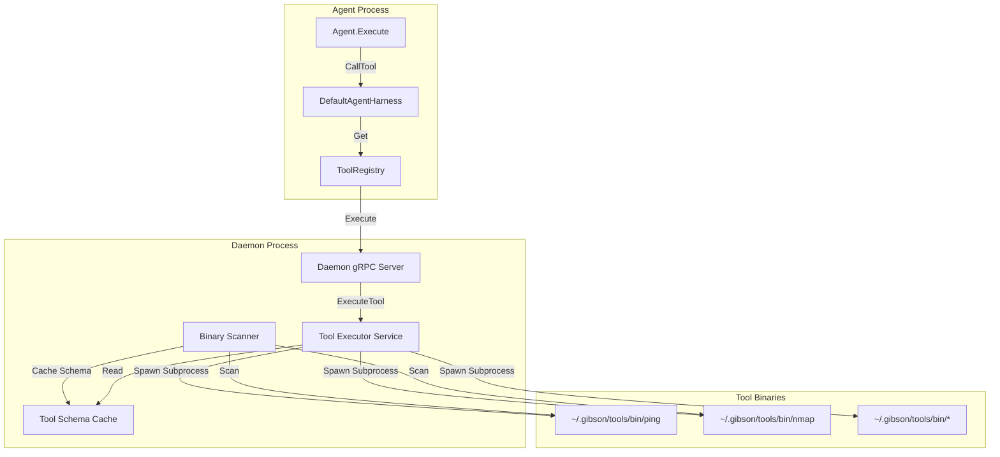
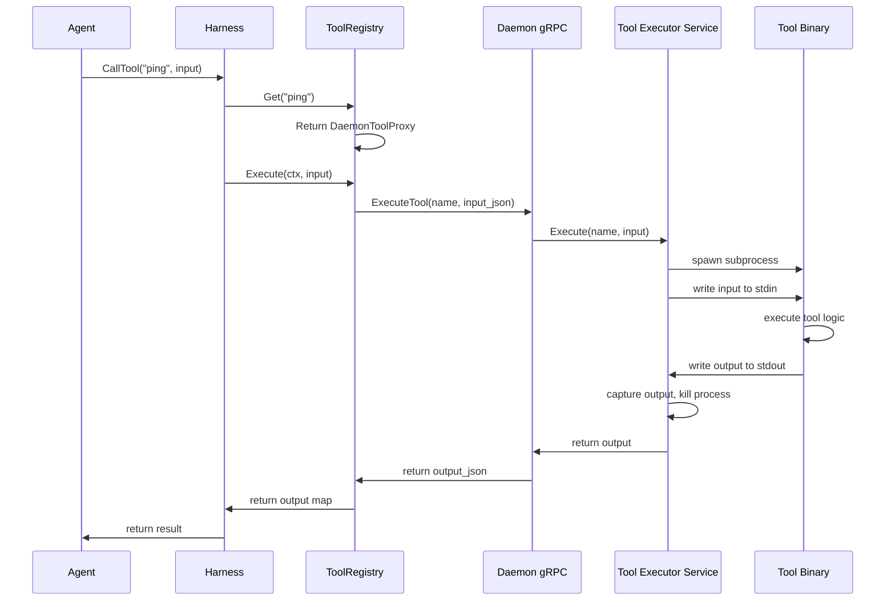

# Design Document: Tool Executor Service

## Overview

The Tool Executor Service is a daemon-managed component that centralizes all tool execution through a subprocess-based model. Instead of tools running as individual gRPC servers on separate ports, the Tool Executor Service:

1. Maintains a registry of installed tool binaries (`~/.gibson/tools/bin/`)
2. Caches tool schemas for fast discovery
3. Executes tools on-demand as short-lived subprocesses
4. Provides a unified API for tool invocation through the daemon

This eliminates the need for `gibson tool start/stop` commands, per-tool port management, and individual etcd registrations. Tools become "batteries included" - install once, available everywhere.

## Code Reuse Analysis

### Existing Components to Leverage

- **`internal/tool/interface.go`**: The `Tool` interface and `ToolDescriptor` type remain unchanged. The Tool Executor Service will produce tool implementations that satisfy this interface.

- **`internal/tool/registry.go`**: The `ToolRegistry` interface and `DefaultToolRegistry` will be reused for in-memory tool registration. The Tool Executor Service will register `SubprocessTool` implementations with this registry.

- **`internal/tool/types.go`**: `ToolMetrics` and error types are reused for metrics tracking.

- **`internal/harness/implementation.go`**: The `CallTool()` method's local registry lookup remains unchanged. The change is upstream - the daemon populates the registry with subprocess-backed tools instead of gRPC-backed tools.

- **`internal/daemon/daemon.go`**: The daemon lifecycle hooks (`Start()`, `Stop()`) will be extended to initialize and shutdown the Tool Executor Service.

- **`internal/daemon/api/daemon.proto`**: New RPCs will be added for `ExecuteTool`, `ListAvailableTools`, and `GetToolSchema`.

### Integration Points

- **Harness → ToolRegistry**: Unchanged. Harness calls `toolRegistry.Get(name)` which returns a `Tool` interface.

- **Daemon → Tool Executor Service**: New integration. Daemon initializes the service on startup and routes tool execution requests to it.

- **SDK `serve.Tool()`**: Modified to detect `GIBSON_TOOL_MODE=subprocess` and run in stdin/stdout mode instead of gRPC server mode.

- **etcd Registry**: Tools no longer register individually. The daemon's Tool Executor Service is the single source of truth for available tools.

## Architecture



### Execution Flow



## Components and Interfaces

### Component 1: Tool Executor Service

- **Purpose:** Central service that manages tool binary discovery, schema caching, and subprocess execution.
- **Location:** `internal/daemon/toolexec/service.go`
- **Interfaces:**
  ```go
  type ToolExecutorService interface {
      // Start initializes the service, scans for tools, and caches schemas
      Start(ctx context.Context) error

      // Stop gracefully shuts down the service and kills any running subprocesses
      Stop(ctx context.Context) error

      // Execute runs a tool with the given input and returns the output
      Execute(ctx context.Context, name string, input map[string]any, timeout time.Duration) (map[string]any, error)

      // ListTools returns descriptors for all available tools
      ListTools() []tool.ToolDescriptor

      // GetToolSchema returns the schemas for a specific tool
      GetToolSchema(name string) (*ToolSchema, error)

      // RefreshTools rescans the tools directory for new/removed tools
      RefreshTools(ctx context.Context) error
  }
  ```
- **Dependencies:**
  - `internal/tool` (interfaces and types)
  - `os/exec` (subprocess management)
  - File system access to `~/.gibson/tools/bin/`
- **Reuses:** `tool.ToolDescriptor`, `tool.ToolMetrics`

### Component 2: Binary Scanner

- **Purpose:** Scans the tools directory, invokes each binary with `--schema` flag, and builds the tool registry.
- **Location:** `internal/daemon/toolexec/scanner.go`
- **Interfaces:**
  ```go
  type BinaryScanner interface {
      // Scan discovers all tool binaries and returns their descriptors
      Scan(ctx context.Context, toolsDir string) ([]ToolBinaryInfo, error)

      // GetSchema invokes a tool with --schema and parses the result
      GetSchema(ctx context.Context, binaryPath string) (*ToolSchema, error)
  }

  type ToolBinaryInfo struct {
      Name        string
      BinaryPath  string
      Schema      *ToolSchema // nil if schema fetch failed
      SchemaError error       // non-nil if schema fetch failed
  }

  type ToolSchema struct {
      Name         string
      Version      string
      Description  string
      Tags         []string
      InputSchema  schema.JSON
      OutputSchema schema.JSON
  }
  ```
- **Dependencies:** `os/exec`, `encoding/json`
- **Reuses:** `schema.JSON` from SDK

### Component 3: Subprocess Executor

- **Purpose:** Handles the actual subprocess spawning, stdin/stdout communication, and timeout enforcement.
- **Location:** `internal/daemon/toolexec/executor.go`
- **Interfaces:**
  ```go
  type SubprocessExecutor interface {
      // Execute spawns a subprocess and runs the tool
      Execute(ctx context.Context, req *ExecuteRequest) (*ExecuteResult, error)
  }

  type ExecuteRequest struct {
      BinaryPath string
      Input      map[string]any
      Timeout    time.Duration
      Env        []string // Additional environment variables
  }

  type ExecuteResult struct {
      Output   map[string]any
      Duration time.Duration
      ExitCode int
  }
  ```
- **Dependencies:** `os/exec`, `context`, `encoding/json`

### Component 4: Daemon Tool Proxy

- **Purpose:** Implements the `tool.Tool` interface by proxying execution to the daemon's Tool Executor Service via gRPC.
- **Location:** `internal/harness/daemon_tool_proxy.go`
- **Interfaces:**
  ```go
  type DaemonToolProxy struct {
      client     api.DaemonServiceClient
      descriptor tool.ToolDescriptor
  }

  // Implements tool.Tool interface
  func (p *DaemonToolProxy) Name() string
  func (p *DaemonToolProxy) Description() string
  func (p *DaemonToolProxy) Version() string
  func (p *DaemonToolProxy) Tags() []string
  func (p *DaemonToolProxy) InputSchema() schema.JSON
  func (p *DaemonToolProxy) OutputSchema() schema.JSON
  func (p *DaemonToolProxy) Execute(ctx context.Context, input map[string]any) (map[string]any, error)
  func (p *DaemonToolProxy) Health(ctx context.Context) types.HealthStatus
  ```
- **Dependencies:** `internal/daemon/api` (gRPC client), `internal/tool`
- **Reuses:** `tool.Tool` interface, `tool.ToolDescriptor`

### Component 5: SDK Subprocess Mode

- **Purpose:** Enables tool binaries built with the SDK to run in subprocess mode (stdin/stdout) instead of gRPC server mode.
- **Location:** `sdk/serve/subprocess.go` (new file)
- **Interfaces:**
  ```go
  // RunSubprocess executes the tool in subprocess mode
  // Called when GIBSON_TOOL_MODE=subprocess is set
  func RunSubprocess(t tool.Tool) error

  // OutputSchema outputs the tool schema as JSON to stdout
  // Called when --schema flag is passed
  func OutputSchema(t tool.Tool) error
  ```
- **Dependencies:** `encoding/json`, `os`
- **Reuses:** `tool.Tool` interface

## Data Models

### ToolBinaryInfo

```go
// ToolBinaryInfo represents a discovered tool binary
type ToolBinaryInfo struct {
    Name        string       `json:"name"`
    BinaryPath  string       `json:"binary_path"`
    Version     string       `json:"version"`
    Description string       `json:"description"`
    Tags        []string     `json:"tags"`
    InputSchema schema.JSON  `json:"input_schema"`
    OutputSchema schema.JSON `json:"output_schema"`
    SchemaError string       `json:"schema_error,omitempty"` // Non-empty if schema fetch failed
    DiscoveredAt time.Time   `json:"discovered_at"`
}
```

### ToolExecutionMetrics

```go
// ToolExecutionMetrics tracks per-tool execution statistics
type ToolExecutionMetrics struct {
    ToolName       string        `json:"tool_name"`
    TotalCalls     int64         `json:"total_calls"`
    SuccessCalls   int64         `json:"success_calls"`
    FailedCalls    int64         `json:"failed_calls"`
    TotalDuration  time.Duration `json:"total_duration"`
    AvgDuration    time.Duration `json:"avg_duration"`
    LastExecutedAt *time.Time    `json:"last_executed_at,omitempty"`
    LastError      string        `json:"last_error,omitempty"`
}
```

### Daemon Proto Additions

```protobuf
// ExecuteToolRequest executes a tool via the Tool Executor Service
message ExecuteToolRequest {
    string name = 1;          // Tool name
    string input_json = 2;    // JSON-encoded input
    int64 timeout_ms = 3;     // Timeout in milliseconds (0 = default)
}

// ExecuteToolResponse returns tool execution result
message ExecuteToolResponse {
    bool success = 1;
    string output_json = 2;   // JSON-encoded output (if success)
    string error = 3;         // Error message (if !success)
    int64 duration_ms = 4;    // Execution duration
}

// GetAvailableToolsRequest queries available tools
message GetAvailableToolsRequest {}

// GetAvailableToolsResponse returns available tool descriptors
message GetAvailableToolsResponse {
    repeated ToolDescriptor tools = 1;
}

// ToolDescriptor describes a tool's capabilities
message ToolDescriptor {
    string name = 1;
    string version = 2;
    string description = 3;
    repeated string tags = 4;
    string input_schema_json = 5;   // JSON-encoded schema
    string output_schema_json = 6;  // JSON-encoded schema
    string status = 7;              // "ready", "schema-unknown", "error"
    string error_message = 8;       // Non-empty if status is "error"
}
```

## Error Handling

### Error Scenarios

1. **Tool Binary Not Found**
   - **Handling:** Return `ErrToolNotFound` with available tools list
   - **User Impact:** Clear error message: "Tool 'foo' not found. Available tools: ping, nmap, ..."

2. **Schema Fetch Timeout**
   - **Handling:** Mark tool as "schema-unknown", log warning, allow execution
   - **User Impact:** Tool usable but no input validation; warning in `gibson tool list`

3. **Tool Execution Timeout**
   - **Handling:** Kill subprocess with SIGKILL, return `ErrToolTimeout`
   - **User Impact:** Error message with timeout value and suggestion to increase

4. **Tool Execution Failure (Non-Zero Exit)**
   - **Handling:** Capture stderr, return `ErrToolExecutionFailed` with stderr contents
   - **User Impact:** Error includes tool stderr for debugging

5. **Invalid Tool Output (Not JSON)**
   - **Handling:** Return `ErrInvalidToolOutput` with raw stdout snippet
   - **User Impact:** Error indicates tool produced invalid output

6. **Subprocess Spawn Failure**
   - **Handling:** Log error, return `ErrToolSpawnFailed`
   - **User Impact:** Error suggests checking binary permissions/path

7. **Tool Directory Missing**
   - **Handling:** Create directory automatically on daemon start
   - **User Impact:** None - handled transparently

## Testing Strategy

### Unit Testing

- **BinaryScanner**: Mock filesystem and exec.Command to test:
  - Directory scanning with various file states
  - Schema parsing from valid/invalid JSON
  - Timeout handling during schema fetch

- **SubprocessExecutor**: Mock exec.Command to test:
  - Input serialization to stdin
  - Output capture from stdout
  - Timeout enforcement and SIGKILL
  - Exit code handling

- **ToolExecutorService**: Mock BinaryScanner and SubprocessExecutor to test:
  - Tool registration on startup
  - Concurrent execution handling
  - Metrics recording
  - Hot-reload of new tools

- **DaemonToolProxy**: Mock gRPC client to test:
  - Tool interface method implementations
  - Error propagation from daemon

### Integration Testing

- **End-to-End Tool Execution**:
  - Create a test tool binary that echoes input
  - Install to test tools directory
  - Verify execution via daemon API
  - Verify metrics recorded

- **Schema Discovery**:
  - Create tools with/without `--schema` support
  - Verify schema caching behavior
  - Verify "schema-unknown" status handling

- **Timeout Enforcement**:
  - Create a tool binary that sleeps indefinitely
  - Verify timeout kills subprocess
  - Verify proper cleanup

- **Hot Reload**:
  - Start daemon with tools A, B
  - Add tool C to directory
  - Verify tool C becomes available without daemon restart

### End-to-End Testing

- **Agent Tool Usage**:
  - Run debug agent with network-recon module
  - Verify ping/nmap tools are invoked via Tool Executor Service
  - Verify findings are produced

- **CLI Tool Commands**:
  - `gibson tool list` shows available tools with status
  - `gibson tool invoke ping --input '{"targets":["localhost"]}'` works
  - `gibson tool status` shows metrics

## Migration Plan

### Phase 1: Add Tool Executor Service (Non-Breaking)
1. Implement `internal/daemon/toolexec/` package
2. Initialize service in daemon startup
3. Add new proto RPCs (`ExecuteTool`, `GetAvailableTools`)
4. Harness continues using existing discovery path

### Phase 2: SDK Subprocess Mode
1. Add `sdk/serve/subprocess.go`
2. Modify `serve.Tool()` to detect `GIBSON_TOOL_MODE`
3. Add `--schema` flag handling
4. Update example tools to support subprocess mode

### Phase 3: Wire Harness to Tool Executor
1. Create `DaemonToolProxy` in harness
2. Modify harness factory to populate registry with daemon proxies
3. Remove etcd-based tool discovery from harness

### Phase 4: Remove Legacy Tool Commands
1. Remove `gibson tool start` command
2. Remove `gibson tool stop` command
3. Update `gibson tool list` to use Tool Executor Service
4. Remove individual tool etcd registration from SDK
5. Update documentation

## File Changes Summary

### New Files
- `internal/daemon/toolexec/service.go` - Tool Executor Service
- `internal/daemon/toolexec/scanner.go` - Binary Scanner
- `internal/daemon/toolexec/executor.go` - Subprocess Executor
- `internal/daemon/toolexec/metrics.go` - Execution metrics
- `internal/harness/daemon_tool_proxy.go` - Tool proxy for harness
- `sdk/serve/subprocess.go` - SDK subprocess mode

### Modified Files
- `internal/daemon/daemon.go` - Initialize Tool Executor Service
- `internal/daemon/api/daemon.proto` - Add new RPCs
- `internal/daemon/grpc.go` - Implement new RPC handlers
- `internal/harness/factory.go` - Wire up daemon tool proxies
- `sdk/serve/tool.go` - Detect subprocess mode
- `cmd/gibson/tool.go` - Update `tool list`, remove `start`/`stop`
- `cmd/gibson/component/lifecycle.go` - Remove tool start/stop for tools

### Deleted Files
- `internal/daemon/component_lifecycle.go` - Tool-specific parts (keep agent/plugin)
- `internal/registry/grpc_tool_client.go` - No longer needed
